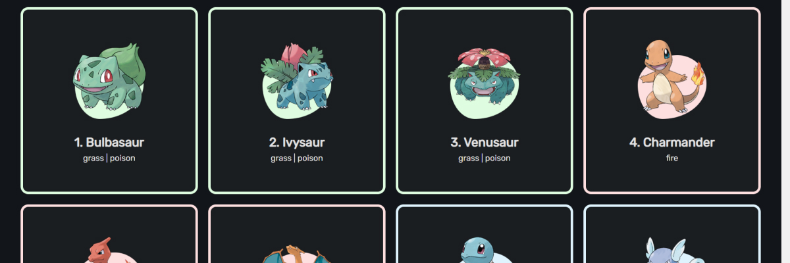

<h1 align="center">
  Pokedex utilizando apenas javascript
</h1>

<h6 align="center">Como construir uma pokedex com JavaScript puro, sem frameworks.</h6>
 

<h2 align="center">Link para o vídeo</h2>

---

<h2 align="center">Como baixar este repositório</h2>

Para baixar este repositório em sua máquina, você pode clicar no botão verde "Code" (ali em cima) e fazer download do .zip ou, caso você tenha noções de Git, você pode forká-lo e/ou cloná-lo.
 

---

<h2 align="center">Deseja falar comigo?</h2>

Envie um email para <a href="mailto:contato@esalanguerra.com.br">contato@esalanguerra.com.br</a>

